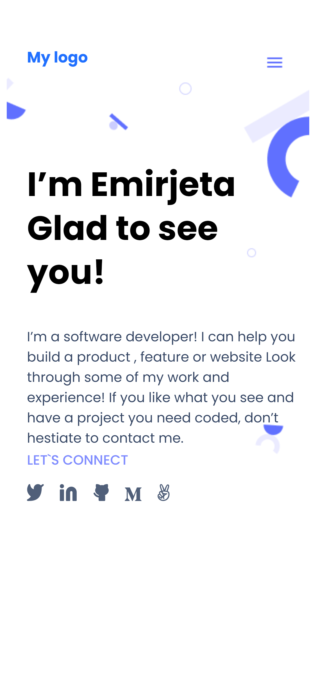

# Portfolio

> This project is meant for building a profesional developer portfolio for future employers to evaluate my coding skills.

## Built With

-HTML & CSS

## Live Demo

[Live Demo Link](https://myelin0.github.io/myportfolio/#Portfolio)

## Authors

👤 **Emirjeta Veisllari**

- GitHub: [@myelin0](https://github.com/myelin0)
- Twitter: [@Amy_Albania](https://twitter.com/Amy_albania)
- LinkedIn: [@Emirjeta Veisllari](https://www.linkedin.com/in/emirjeta-veisllari/)
## 🤝 Contributing

Contributions, issues, and feature requests are welcome!

Feel free to check the [issues page](../../issues/).

## Show your support

Give a ⭐️ if you like this project!

## Acknowledgments

- Hat tip to anyone whose code was used
- Inspiration
- etc

## 📝 License

This project is [MIT](./MIT.md) licensed.
